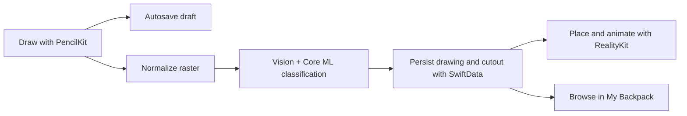

# AniMagic

AniMagic is an iOS and iPadOS application that turns hand-drawn animal doodles into animated augmented-reality objects. Users draw with PencilKit, classify the drawing locally with Vision and Core ML, keep their work in a SwiftData-backed library, and place the resulting cutout in a RealityKit scene.

> The project currently targets iOS 18.0 and is designed for iPhone and iPad.

## Highlights

- **PencilKit canvas** with Apple Pencil support, the system tool picker, undo/redo, drawing guides, editable names, and debounced draft autosave.
- **On-device doodle classification** using Vision and the bundled `AnimalSpeciesClassifierV4.mlpackage` Core ML model, trained from scratch with Google Quick, Draw! data.
- **Reliable classification workflow** with cancellable jobs, stale-result protection, persisted error states, Retry, and an option to continue into AR.
- **AR placement** powered by ARKit and RealityKit, including surface detection, placement feedback, object selection, deletion, and animated animal motion presets.
- **My Backpack** for persistent drawings, search, category filters, automatic AI-based naming, sharing, and classification recovery.
- **Virtual Room** with explore/edit modes and Citrus Orchard, Land, and Underwater environments.
- **Cutout library module** using Vision foreground instance masks to prepare imported photos for AR.

## App flow



Classification runs locally on the device. The drawing raster keeps transparent padding for AR, while the classifier receives a normalized square image with a white background.

## Technology

| Area | Frameworks and tools |
| --- | --- |
| UI and state | SwiftUI, Observation |
| Drawing | PencilKit |
| Classification | Core ML, Vision, Core Image |
| AR and rendering | ARKit, RealityKit, Metal |
| Persistence | SwiftData |
| Motion | GameplayKit, Core Motion |
| Project generation | XcodeGen |

## Requirements

- macOS with **Xcode 16 or newer**
- iOS/iPadOS **18.0 or newer**
- A physical ARKit-compatible iPhone or iPad for camera tracking and AR placement
- An iPad with Apple Pencil for testing Pencil input and palm rejection
- An Apple Developer team when running on a physical device
- XcodeGen only when regenerating the Xcode project

The iOS Simulator can build and exercise non-camera screens, but it cannot fully validate AR tracking, camera permission behavior, or Apple Pencil interaction.

## Getting started

1. Clone the repository:

   ```bash
   git clone https://github.com/dimaswisodewo/Animagic.git
   cd Animagic
   ```

2. Open the committed Xcode project:

   ```bash
   open AniMagic.xcodeproj
   ```

3. Select the **AniMagic** scheme.
4. Choose an iOS 18+ simulator or a supported physical device.
5. For a physical device, select your team under **Signing & Capabilities**.
6. Build and run.

The Core ML model and all current fonts, USDZ assets, skyboxes, images, and audio resources are already included in the repository.

## Core ML model

The doodle classifier is stored at:

```text
Animagic/Resources/Models/AnimalSpeciesClassifierV4.mlpackage
```

At build time, Xcode compiles the package into `AnimalSpeciesClassifierV4.mlmodelc`. Runtime loading is implemented in `Animagic/Core/ImageProcessing/DoodleClassification.swift`.

The bundled V4 model is trained specifically for AniMagic from Google's [Quick, Draw! dataset](https://github.com/googlecreativelab/quickdraw-dataset), without third-party pretrained model weights. The companion [`animal-sketch-coreml`](https://github.com/MorpKnight/animal-sketch-coreml) repository contains the training, evaluation, and Core ML export pipelines, along with the model-generation history and published artifacts.

When replacing the model:

1. Keep the resource name `AnimalSpeciesClassifierV4.mlpackage`, or update the runtime lookup.
2. Ensure the package is included in the **AniMagic** target.
3. Preserve the expected image-classifier output (`VNClassificationObservation`).
4. Re-test label-to-motion mapping and low-confidence behavior in AR.
5. Perform a clean build so Xcode recompiles the model.

The current model recognizes multiple animal-sketch classes, including birds, aquatic animals, mammals, reptiles, insects, and an `other` class. RealityKit behavior is resolved separately through the supported animal archetypes in `LocomotionConfiguration.swift`.

## Project structure

```text
Animagic/
├── App/
│   ├── Navigation/          # AppRoute and NavigationRouter
│   └── State/               # Cross-feature session state
├── Core/
│   ├── ImageProcessing/     # Rasterization, Vision, and Core ML
│   ├── Models/              # Domain value types
│   ├── Persistence/         # SwiftData records and repository
│   ├── Rendering/           # RealityKit and Metal rendering
│   └── Stores/              # Artwork library orchestration
├── Features/
│   ├── ARPlacement/
│   ├── Backpack/
│   ├── Canvas/
│   ├── CutoutLibrary/
│   ├── HanddrawnDetail/
│   ├── Home/
│   └── VirtualRoom/
├── Resources/               # Assets, fonts, Core ML, USDZ, and skyboxes
└── Shared/                  # Design system and reusable UI
```

Navigation is centralized in `AppRoute` and `NavigationRouter`. Feature views coordinate presentation, while image processing, persistence, and rendering are kept under `Core`.

## Persistence

Artwork is stored locally using SwiftData:

- `SavedDrawingRecord` stores the PencilKit drawing, name, category, classification metadata, manual-name status, and creation date.
- `CutoutAssetRecord` stores the rendered PNG, source drawing ID, original dimensions, classification result or error, and optional corrected label.

Empty drawings are rejected. Draft autosave updates the active drawing ID rather than creating duplicate records, and autosave never starts classification or AR navigation.

## Permissions

AniMagic requests:

- **Camera access** for AR placement.
- **Photo Library Add access** when saving artwork to Photos.

If camera access is denied, enable it from **Settings → Privacy & Security → Camera → AniMagic**.

## Regenerating the Xcode project

The committed `AniMagic.xcodeproj` is generated from `project.yml`.

Install XcodeGen:

```bash
brew install xcodegen
```

Verify that the committed project matches the specification:

```bash
./generate-project.sh --check
```

Regenerate it after changing targets, resources, or build settings:

```bash
./generate-project.sh
```

Commit `project.yml` and the regenerated `AniMagic.xcodeproj` together.

## Build from the command line

Compile for a generic iOS Simulator without code signing:

```bash
xcodebuild \
  -project AniMagic.xcodeproj \
  -scheme AniMagic \
  -configuration Debug \
  -destination 'generic/platform=iOS Simulator' \
  CODE_SIGNING_ALLOWED=NO \
  build
```

There is currently no XCTest target. Changes should at minimum pass a simulator build and be manually checked on appropriate hardware for PencilKit and AR behavior.

## Troubleshooting

### The Core ML model cannot be loaded

- Confirm that `AnimalSpeciesClassifierV4.mlpackage` exists under `Animagic/Resources/Models`.
- Confirm target membership and the exact resource name.
- Clean the build folder and rebuild.

### AR does not start or cannot find a surface

- Use a physical ARKit-compatible device.
- Grant camera access.
- Move the device slowly in a well-lit area with visible surface detail.
- Use Retry if the AR session reports a recoverable failure.

### Xcode reports a capitalization mismatch

Preserve the repository's exact capitalization:

- Project: `AniMagic.xcodeproj`
- Source directory: `Animagic`

Do not rename one without updating `project.yml` and regenerating the project.

### The generated project is out of date

Run `./generate-project.sh`, then review and commit both `project.yml` and `AniMagic.xcodeproj/project.pbxproj`.

## Development notes

- Keep application navigation in `AppRoute` and `NavigationRouter`.
- Put feature-specific code under `Animagic/Features/<FeatureName>`.
- Put reusable image processing, persistence, models, and rendering infrastructure under `Animagic/Core`.
- Preserve manual drawing names when applying AI-generated names.
- Test AR and Apple Pencil changes on physical hardware before release.

## License

This repository does not currently include a license file. Unless a license is added, permission to copy, modify, or redistribute the project is not granted automatically.
