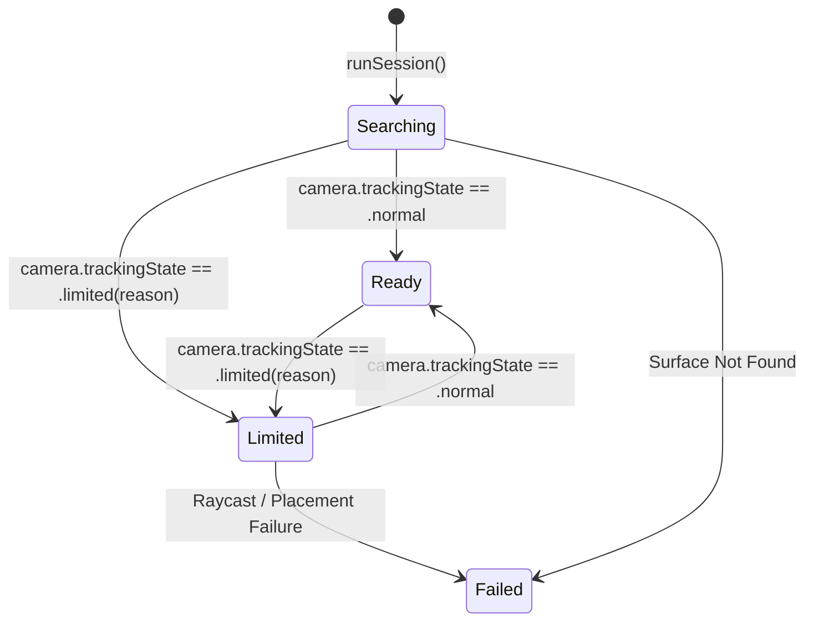
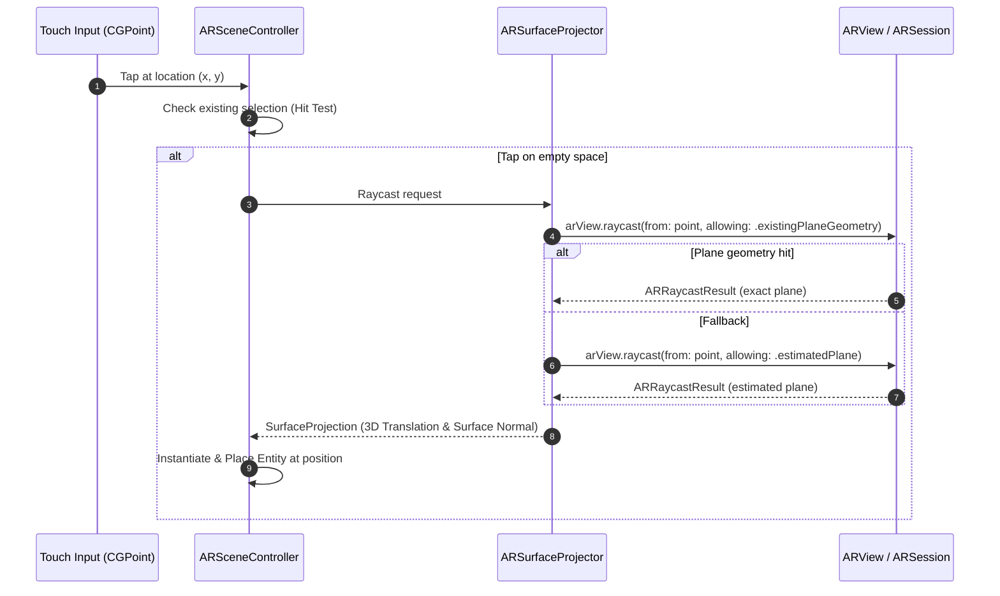

<!--
  ARKIT_REALITYKIT_DEEP_DIVE.md
  AniMagic

  Created by Meynabel Dimas Wisodewo on 20/07/26.
-->

# ARKit & RealityKit Architecture Deep Dive

This document provides a low-level, deeply technical architectural guide to the **Augmented Reality (ARKit)** and **3D Rendering Engine (RealityKit / Metal)** powering **AniMagic**. 

It is written specifically for engineers who want to understand the exact lifecycle, frame update loops, custom shader pipelines, surface raycasting, entity-component dynamics, and gesture interaction mechanics used in AniMagic.

For the complete production path from PencilKit input through Core ML,
procedural cardboard geometry, placement, and animation, see
[Hand Drawing to Animated AR](HAND_DRAWING_TO_ANIMATED_AR.md). The active
application route uses `NewARPlacementView` and its RealityKit
`ARPlacementSystem`; some controller examples below describe the older
`ARObjectPlacementRealityView` path.

---

## Table of Contents
1. [Subsystem Architecture Overview](#1-subsystem-architecture-overview)
2. [ARSession Lifecycle & Configuration Flow](#2-arsession-lifecycle--configuration-flow)
3. [AR Tracking States & Error Propagation](#3-ar-tracking-states--error-propagation)
4. [Environment Scanning, Raycasting & Plane Projection](#4-environment-scanning-raycasting--plane-projection)
5. [RealityKit Entity-Component-System (ECS) Architecture](#5-realitykit-entity-component-system-ecs-architecture)
6. [3D Mesh Generation & Double-Sided Rendering](#6-3d-mesh-generation--double-sided-rendering)
7. [Custom Metal Shaders & Procedural Vertex Deformation](#7-custom-metal-shaders--procedural-vertex-deformation)
8. [Gesture Interaction Pipeline & Hit Testing](#8-gesture-interaction-pipeline--hit-testing)
9. [Autonomous Locomotion & Physics Simulation](#9-autonomous-locomotion--physics-simulation)
10. [Virtual Room Environment, Motion Sensors & Spatial Audio](#10-virtual-room-environment-motion-sensors--spatial-audio)

---

## 1. Subsystem Architecture Overview

The 3D subsystem abstracts lower-level ARKit and RealityKit calls behind high-level, testable protocols (`SceneEditing`, `SurfaceProjecting`, `ObjectInteractionManaging`).

```
                                  ┌─────────────────────────┐
                                  │   NewARPlacementView    │
                                  └────────────┬────────────┘
                                               │ Wraps via UIViewRepresentable
                                               ▼
                                  ┌─────────────────────────┐
                                  │   ARSceneController     │
                                  │   (ARSessionDelegate)   │
                                  └────────────┬────────────┘
                                               │ Delegates Scene Operations
                                               ▼
                                  ┌─────────────────────────┐
                                  │   CutoutSceneEditor     │
                                  └────┬──────────────┬─────┘
                                       │              │
                    Entity Construction│              │ Interactivity & Projection
                                       ▼              ▼
     ┌───────────────────────────────────┐    ┌───────────────────────────────────┐
     │  CutoutEntityFactory / Metal      │    │  ARViewInteractionAdapter         │
     │  ShadowEntityFactory              │    │  ObjectInteractionManager         │
     └───────────────────────────────────┘    └───────────────────────────────────┘
```

---

## 2. ARSession Lifecycle & Configuration Flow

The entry point for AR is `ARSceneController` (`Animagic/Features/ARPlacement/Scene/ARSceneController.swift`).

### Session Configuration Logic

```swift
func runSession(on arView: ARView) {
    guard ARWorldTrackingConfiguration.isSupported else { return }

    let configuration = ARWorldTrackingConfiguration()
    configuration.planeDetection = [.horizontal]
    arView.session.delegate = self

    configureSceneOcclusion(on: arView, with: configuration)
    
    arView.session.run(
        configuration,
        options: [.resetTracking, .removeExistingAnchors]
    )
    
    // Performance optimizations: Disable heavy post-processing
    arView.renderOptions.insert(.disableGroundingShadows)
    arView.renderOptions.insert(.disableDepthOfField)
    
    // Attach gesture adapter & display link loop
    sceneEditor.attachInteraction(to: arView, surfaceProjector: ARSurfaceProjector()) { [weak self] point in
        self?.handleEmptyTap(at: point, in: arView)
    }
    startAnimationLoop(in: arView)
    updateStatus(.searching)
}
```

### Scene Reconstruction & Occlusion Hierarchy
AniMagic dynamically configures scene understanding based on hardware capabilities (e.g., LiDAR vs camera-only devices):

```swift
private func configureSceneOcclusion(
    on arView: ARView,
    with configuration: ARWorldTrackingConfiguration
) {
    if ARWorldTrackingConfiguration.supportsSceneReconstruction(.meshWithClassification) {
        // LiDAR hardware: Real-time mesh reconstruction with semantic classification
        configuration.sceneReconstruction = .meshWithClassification
        arView.environment.sceneUnderstanding.options.insert(.occlusion)
    } else if ARWorldTrackingConfiguration.supportsSceneReconstruction(.mesh) {
        // LiDAR hardware: Basic mesh reconstruction
        configuration.sceneReconstruction = .mesh
        arView.environment.sceneUnderstanding.options.insert(.occlusion)
    } else {
        // Non-LiDAR hardware: Disable mesh occlusion
        arView.environment.sceneUnderstanding.options.remove(.occlusion)
    }

    // Enable real-time person segmentation & depth matting if supported
    if ARWorldTrackingConfiguration.supportsFrameSemantics(.personSegmentationWithDepth) {
        configuration.frameSemantics.insert(.personSegmentationWithDepth)
    }
}
```

---

## 3. AR Tracking States & Error Propagation

`ARSceneController` implements `ARSessionDelegate` to monitor device tracking quality in real-time.



### Tracking State Mapping Code (`ARSceneController.swift`):
```swift
func session(_ session: ARSession, cameraDidChangeTrackingState camera: ARCamera) {
    switch camera.trackingState {
    case .normal: 
        updateStatus(.ready)
    case .limited(let reason): 
        updateStatus(.limited(reason.message))
    case .notAvailable: 
        updateStatus(.limited("Camera tracking is unavailable."))
    }
}
```

#### Tracking Reason Messages:
- `.initializing`: *"Move your phone slowly to scan the floor or a table."*
- `.excessiveMotion`: *"Move more slowly to improve tracking."*
- `.insufficientFeatures`: *"Move to a brighter area with more visible texture."*
- `.relocalizing`: *"Reacquiring the scene…"*

---

## 4. Environment Scanning, Raycasting & Plane Projection

When a user taps on the screen, AniMagic determines the exact 3D coordinate on a physical horizontal surface using raycasting.

### Surface Raycasting Algorithm (`ARSceneController.swift` & `SurfaceProjectors.swift`)



### Plane Vector Extraction
The 3D position and surface normal are extracted directly from `ARRaycastResult.worldTransform`:

```swift
let translation = result.worldTransform.translation // SIMD3<Float>(x, y, z)
let normal = simd_normalize([
    result.worldTransform.columns.1.x,
    result.worldTransform.columns.1.y,
    result.worldTransform.columns.1.z
]) // Extract Y column as surface normal vector
```

---

## 5. RealityKit Entity-Component-System (ECS) Architecture

AniMagic leverages RealityKit's Entity-Component-System (ECS) pattern to attach behavior, collision filters, shadow properties, and custom components to placed objects.

### Custom RealityKit Components
- **`InteractableComponent`**: Identifies entity root by storing the unique `objectID: UUID`.
- **`InputTargetComponent`**: Registers entity for RealityKit gesture hit-testing.
- **`CollisionComponent`**: Sets bounding box collision filters on the `.interactable` group.
- **`GroundingShadowComponent`**: Controls built-in shadow casting options.

### Placed Cutout Entity Hierarchy
When an object is placed, `CutoutEntityFactory` constructs a composite entity tree:

```
AnchorEntity (World Transform Anchor)
  └── Root Entity (Entity)
        ├── Body Entity (Entity + CollisionComponent + InputTargetComponent + InteractableComponent)
        │     ├── Front ModelEntity (Subdivided Mesh + Front CutoutDeformationMaterial)
        │     └── Back ModelEntity (Subdivided Mesh + Back CutoutDeformationMaterial [Rotated 180°])
        └── Shadow ModelEntity (Plane Mesh + Soft Shadow UnlitMaterial) [Optional]
```

---

## 6. 3D Mesh Generation & Double-Sided Rendering

Because 2D cutouts need to warp and deform realistically in 3D space, standard
2-triangle planes are insufficient. AniMagic generates economy (12×12),
balanced (20×20), and hero (32×32) grids and can crown them using the cardboard
surface field. The contour-derived rim and LOD behavior are documented in
[Hand Drawing to Animated AR](HAND_DRAWING_TO_ANIMATED_AR.md#5-alpha-analysis-and-procedural-mesh-generation).

### Subdivided Grid Generation (`CutoutRenderingResources.swift`)

```swift
enum DenseCutoutMesh {
    static let subdivisions = 20 // 20x20 grid = 441 vertices, 800 triangles

    static func generate(width: Float, height: Float) throws -> MeshResource {
        let columns = subdivisions + 1
        let rows = subdivisions + 1
        var positions: [SIMD3<Float>] = []
        var normals: [SIMD3<Float>] = []
        var textureCoordinates: [SIMD2<Float>] = []
        var indices: [UInt32] = []

        for row in 0..<rows {
            let v = Float(row) / Float(subdivisions)
            for column in 0..<columns {
                let u = Float(column) / Float(subdivisions)
                positions.append([(u - 0.5) * width, (0.5 - v) * height, 0])
                normals.append([0, 0, 1])
                textureCoordinates.append([u, v])
            }
        }

        for row in 0..<subdivisions {
            for column in 0..<subdivisions {
                let topLeft = UInt32((row * columns) + column)
                let topRight = topLeft + 1
                let bottomLeft = topLeft + UInt32(columns)
                let bottomRight = bottomLeft + 1
                indices.append(contentsOf: [
                    topLeft, bottomLeft, topRight,
                    topRight, bottomLeft, bottomRight
                ])
            }
        }

        var descriptor = MeshDescriptor(name: "Dense cutout plane")
        descriptor.positions = MeshBuffers.Positions(positions)
        descriptor.normals = MeshBuffers.Normals(normals)
        descriptor.textureCoordinates = MeshBuffers.TextureCoordinates(textureCoordinates)
        descriptor.primitives = .triangles(indices)
        return try MeshResource.generate(from: [descriptor])
    }
}
```

---

## 7. Custom Metal Shaders & Procedural Vertex Deformation

To make flat 2D cutouts feel alive, AniMagic uses real-time procedural vertex deformation written in **Metal Shading Language** (`CutoutDeformation.metal`).

### Metal Shader Parameters & Material Setup (`CutoutRenderingResources.swift`)

```swift
// Material binding
material.custom.texture = .init(texture)
material.custom.value = [
    archetype.shaderIndex, // Archetype ID (0.0 to 7.0)
    1.0,                  // Activity scale
    phase,                // Random initial phase offset
    faceDirection         // Direction sign (+1 or -1)
]
```

### Metal Geometry Modifier (`CutoutDeformation.metal`)

The geometry modifier alters `params.geometry().model_position_offset` in real time on the GPU:

```metal
#include <metal_stdlib>
#include <RealityKit/RealityKit.h>

using namespace metal;

[[visible]]
void cutoutGeometryModifier(realitykit::geometry_parameters params)
{
    auto geometry = params.geometry();
    float4 configuration = params.uniforms().custom_parameter();
    float archetype = floor(configuration.x + 0.001);
    float activity = configuration.y;
    float phaseOffset = configuration.z;
    float faceDirection = configuration.w;

    // Gait frequency selection based on AnimalArchetype
    float gaitFrequency = archetype < 0.5 ? 3.8 :  // Aquatic (Fish)
                          archetype < 1.5 ? 5.6 :  // Avian (Bird)
                          archetype < 2.5 ? 8.2 :  // Flutter (Butterfly)
                          archetype < 3.5 ? 3.8 :  // Feline (Pounce)
                          archetype < 4.5 ? 2.0 :  // Canine (Stride)
                          archetype < 5.5 ? 2.7 :  // Amphibian (Hop)
                          archetype < 6.5 ? 3.2 : 6.5; // Reptile (Slither)

    float phase = phaseOffset + params.uniforms().time() * gaitFrequency;
    float2 sourceUV = geometry.uv0();
    float2 uv = float2(faceDirection < 0.0 ? 1.0 - sourceUV.x : sourceUV.x, sourceUV.y);
    float2 centered = (uv - 0.5) * 2.0;

    // Edge falloff mask to anchor center while flexing edges
    float edgeFalloff = smoothstep(0.0, 0.06, uv.x)
        * smoothstep(0.0, 0.06, 1.0 - uv.x)
        * smoothstep(0.0, 0.05, uv.y)
        * smoothstep(0.0, 0.05, 1.0 - uv.y);
    float bodyWeight = 0.72 + 0.28 * edgeFalloff;

    float3 offset = float3(0.0);

    if (archetype < 0.5) { // Aquatic: Tail wave & swimming S-curve
        float tailWeight = smoothstep(0.15, 1.0, abs(centered.x));
        float swim = sin((uv.x * 10.0) - phase);
        offset.z += swim * tailWeight * 0.027 * bodyWeight;
    } else if (archetype < 1.5) { // Avian: Flapping wing displacement
        float wingWeight = smoothstep(0.08, 0.88, abs(centered.x));
        float flap = sin(phase) * wingWeight;
        offset.z += flap * 0.032 * bodyWeight;
    }
    // ... Additional archetypes (butterfly, feline, canine, frog, reptile, insect)

    offset *= activity;
    offset = clamp(offset, float3(-0.045), float3(0.045)); // Safety clamping
    geometry.set_model_position_offset(float3(offset.x * faceDirection, offset.y, offset.z * faceDirection));
}
```

---

## 8. Gesture Interaction Pipeline & Hit Testing

Object manipulation (selecting, dragging, scaling, rotating) is handled by `ARViewInteractionAdapter` (`UIKit` gesture recognizers) and `ObjectInteractionManager`.

```
 Touch Gestures (Pan, Pinch, Rotation)
                 │
                 ▼
  ARViewInteractionAdapter (UIKit Delegate)
                 │
                 │ 1. Convert touch point to entity via arView.hitTest(...)
                 │ 2. Check InteractableComponent
                 ▼
     ObjectInteractionManager
                 │
                 ├── Translate ──> SurfaceProjector.project(...) ──> Position Entity
                 ├── Scale     ──> Clamped scale multiplier [0.25x ... 4.0x]
                 └── Rotate    ──> Rotation quaternion around surface normal axis
```

### Simultaneous Gesture Recognition
Pinch and rotation gestures operate concurrently through `UIGestureRecognizerDelegate`:

```swift
func gestureRecognizer(
    _ gestureRecognizer: UIGestureRecognizer,
    shouldRecognizeSimultaneouslyWith otherGestureRecognizer: UIGestureRecognizer
) -> Bool {
    (gestureRecognizer is UIPinchGestureRecognizer && otherGestureRecognizer is UIRotationGestureRecognizer) ||
    (gestureRecognizer is UIRotationGestureRecognizer && otherGestureRecognizer is UIPinchGestureRecognizer)
}
```

---

## 9. Autonomous Locomotion & Physics Simulation

Objects in AniMagic don't just stay static—they wander autonomously across physical surfaces.

### Frame Update Loop (`ARSceneController.swift` & `CutoutSceneEditor.swift`)

A `CADisplayLink` targets 60 FPS updates to drive `MotionSimulation`:

```swift
@objc private func handleAnimationFrame(_ displayLink: CADisplayLink) {
    let previousTimestamp = lastFrameTimestamp ?? displayLink.timestamp
    let deltaTime = min(Float(displayLink.timestamp - previousTimestamp), 1 / 20)
    lastFrameTimestamp = displayLink.timestamp
    sceneEditor.update(deltaTime: deltaTime)
}
```

### Locomotion Simulation (`MotionSimulation.swift`)
Each `PlacedCutout` runs a locomotion state machine:
- **Wandering Vector**: Random heading direction with smoothed yaw steering.
- **Surface Snapping**: Rotates entity orientation to align with support surface normal vectors.
- **Bounds Clamping**: Bounces entities back if they wander too far from their initial anchor center.

---

## 10. Virtual Room Environment, Motion Sensors & Spatial Audio

For non-AR mode, `RoomCoordinator` (`Animagic/Features/VirtualRoom/RoomCoordinator.swift`) provides a 3D sandbox using `ARView` in `.nonAR` camera mode.

### Key Architectural Highlights:
1. **CoreMotion Camera Rigging**:
   Reads `CMMotionManager` device attitude quaternions at 60 Hz to tilt and pan the 3D camera dynamically as the user holds their device.
2. **Dynamic Lighting**:
   Constructs a lighting rig using `DirectionalLightComponent` (sunlight bounce), `PointLightComponent` (warm lamps), and `SpotLightComponent`.
3. **Spatial Audio (`SpatialAudioComponent`)**:
   Attaches spatial audio resources (`AudioFileResource`) to 3D room entities. Sound pan and volume attenuate dynamically based on the virtual camera's distance and orientation relative to the audio source.
