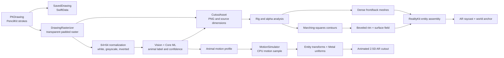
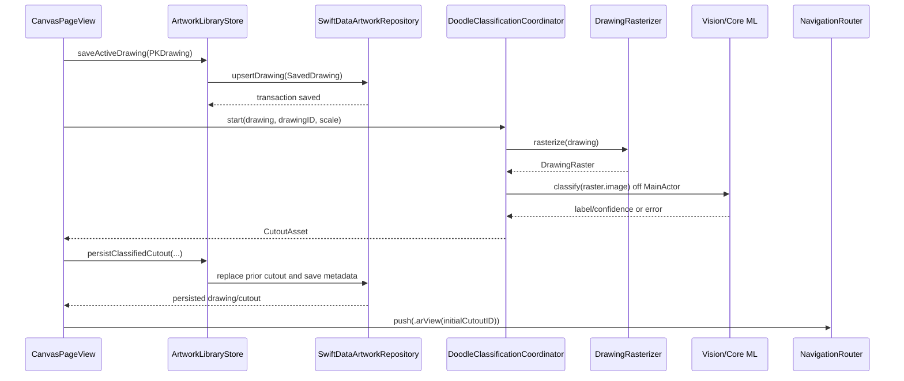

<!--
  HAND_DRAWING_TO_ANIMATED_AR.md
  AniMagic

  Created by dimaswisodewo on 24/07/26.
-->

# Hand Drawing to Animated AR: Technical Pipeline

This document describes the production path that turns a PencilKit drawing into
an animated RealityKit object in AniMagic. It is intended for contributors
changing image processing, persistence, procedural geometry, AR placement, or
motion behavior.

AniMagic does **not** infer a volumetric animal or generate a skeletal 3D model.
It builds a deformable **2.5D cardboard cutout**: the original transparent image
is mapped onto front and back surfaces, a procedural rim supplies thickness, and
Metal geometry modifiers bend the surfaces according to a species-derived motion
profile.

For AR session and interaction details outside this transformation pipeline, see
[ARKit & RealityKit Architecture Deep Dive](ARKIT_REALITYKIT_DEEP_DIVE.md).

## 1. End-to-end architecture



The main ownership boundaries are:

| Stage | Primary types |
| --- | --- |
| Drawing and commit | `CanvasPageView`, `DrawingView`, `DrawingSessionManager` |
| Raster and classification | `DrawingRasterizer`, `DoodleClassificationCoordinator`, `AnimalSpeciesDoodleClassifier` |
| Persistence | `ArtworkLibraryStore`, `SwiftDataArtworkRepository`, `SavedDrawingRecord`, `CutoutAssetRecord` |
| Geometry and materials | `CutoutEntityFactory`, `DenseCutoutMesh`, `CutoutContourExtractor`, `CardboardRimMeshGenerator` |
| AR runtime | `NewARPlacementView`, `NewARSceneController`, `CutoutSceneEditor`, `PlacedCutout` |
| Behavior | `AnimalMotionProfileResolver`, `MotionInstanceConfiguration`, `MotionSimulator` |
| GPU deformation | `CutoutDeformationMaterialController`, `CutoutDeformation.metal` |

### Commit sequence



## 2. Drawing capture and rasterization

`DrawingView` wraps `PKCanvasView`. PencilKit owns vector strokes, tool behavior,
undo history, and Apple Pencil input. `CanvasPageView` owns the save workflow.
Draft autosaves update the active drawing but deliberately do not classify or
navigate to AR.

On an explicit save:

1. The canvas rejects an empty `PKDrawing` or empty drawing bounds.
2. `ArtworkLibraryStore.saveActiveDrawing` persists the editable PencilKit data.
3. `DoodleClassificationCoordinator` rasterizes the same drawing.
4. Classification and cutout persistence complete before navigation to AR.

### Rendering bounds

`DrawingRasterizer.rasterize` uses `PKDrawing.bounds`, then adds transparent
padding:

```text
padding = max(12 points, 12% of the drawing's largest dimension)
renderBounds = drawingBounds inset outward by padding
scale = max(displayScale, 1)
```

The resulting `DrawingRaster` keeps three distinct values:

- `image`: the transparent, padded image used as the RealityKit texture.
- `contentSize`: the unpadded drawing dimensions used as source metadata.
- `renderBounds`: the region supplied to PencilKit during rasterization.

Keeping transparent padding is important. The alpha channel later supplies the
visible bounds, contour mask, holes, and cutout shape. Flattening the image onto
white at this stage would destroy that geometry signal.

## 3. On-device animal classification

Classification is local. `AnimalSpeciesDoodleClassifier` loads the compiled
`AnimalSpeciesClassifierV4.mlmodelc` and wraps it with `VNCoreMLModel`.
`MLModelConfiguration.computeUnits = .all` allows Core ML to choose the available
CPU, GPU, or Neural Engine execution path.

The classifier does not receive the transparent render texture directly. Its
preprocessor creates a separate model input:

1. Scale the source proportionally into a centered 64×64 canvas using aspect-fit.
2. Fill the canvas with white.
3. Convert it to grayscale with `CIColorControls`.
4. Invert it with `CIColorInvert`.
5. Run a `VNCoreMLRequest` using `.scaleFit`.
6. Select the `VNClassificationObservation` with the highest confidence.

This separation is intentional:

```text
AR/render input      = transparent padded color raster
classifier input     = centered 64×64 grayscale inverted raster on white
```

`DoodleClassificationCoordinator` prevents stale results from overwriting new
work. Starting a job cancels the previous task and changes a generation UUID.
The detached classification result is accepted only if the task is not cancelled
and its generation still matches. State transitions are exposed as `idle`,
`running`, `succeeded`, `failed`, or `cancelled`.

Classification failure does not invalidate the image. The factory returns a
`CutoutAsset` containing the raster and the error, which can still enter AR with
the generic motion profile. A successful result stores `label` and `confidence`.
A user correction is stored separately as `doodleOverrideLabel`; it takes
precedence over the predicted label without destroying the model output.

## 4. Persistence and runtime data contracts

The pipeline persists both the editable source and its renderable derivative:

```text
SavedDrawing
├── PKDrawing data
├── name and category
├── classification metadata
├── optional override label
└── manual-name state

CutoutAsset
├── id
├── sourceDrawingID
├── transparent PNG
├── originalSize
├── optional classification
├── optional classification error
├── optional override label
└── defaultPhysicalWidth = 0.35 m
```

`SwiftDataArtworkRepository.persistClassifiedCutout` performs the drawing update,
optional removal of older cutouts for the same drawing, and new cutout insertion
in one explicit transaction. On failure, the context rolls back. Image and
PencilKit blobs use SwiftData external storage.

The classification influences behavior, not mesh topology. Two drawings with
the same label can have completely different silhouettes because geometry comes
from alpha, while their locomotion presets can be identical because behavior
comes from the resolved label.

## 5. Alpha analysis and procedural mesh generation

`CutoutEntityFactory.prepareResources` prewarms the expensive resources when the
selected doodle changes. `makeEntity` later assembles cached resources into the
placed object.

### 5.1 Rig descriptor

`CutoutRigAnalyzer` scans pixels whose alpha is greater than 12 and derives:

- `visibleBounds`: normalized alpha bounds plus two pixels of padding.
- `supportContacts`: the first and last occupied columns in the bottom band.
- `defaultFacing`: the side with more alpha mass.
- `facingConfidence`: normalized left/right mass difference.

The factory crops logically through UV bounds rather than destructively cropping
the image. Physical height is calculated from the visible pixel aspect ratio:

```text
aspectRatio = visiblePixelWidth / visiblePixelHeight
physicalWidth = override ?? 0.35 m
physicalHeight = physicalWidth / aspectRatio
```

Facing falls back to `+1` when the side-mass confidence is below `0.08`.

### 5.2 Front and back surfaces

`DenseCutoutMesh.generate`, defined in
`Core/Rendering/CutoutRenderingResources.swift`, creates a rectangular grid:

```text
columns and rows = subdivisions + 1
vertices         = (subdivisions + 1)²
triangles        = subdivisions² × 2
```

Three levels of detail are generated:

| Quality | Subdivisions | Vertices | Triangles |
| --- | ---: | ---: | ---: |
| Economy | 12 | 169 | 288 |
| Balanced | 20 | 441 | 800 |
| Hero | 32 | 1,089 | 2,048 |

The grid extends six percent beyond normalized content on each edge to leave
space for deformation. UVs map back into `visibleBounds`. If a cardboard surface
field is available, the initial Z position receives a smooth crown and normals
are recomputed from neighboring vertices.

Separate front and rear grids are built. The rear grid mirrors its surface-field
sampling, uses a horizontally mirrored texture around the visible-bounds axis,
and is rotated by π around Y. This avoids relying on double-sided rasterization
and keeps front/back deformation compensation explicit.

### 5.3 Contours, holes, and rim

`CutoutContourExtractor` turns image alpha into polygon loops:

1. Downsample the alpha mask to at most 256 pixels on its largest dimension.
2. Use marching squares with an alpha threshold of 12.
3. Resolve ambiguous marching-squares cells using the cell-average alpha.
4. Join nearby segments into closed loops.
5. Simplify each closed polyline and cap it at 256 points.
6. Determine nesting depth with point-in-polygon tests.
7. Treat even-depth loops as solid outer loops and odd-depth loops as holes.
8. Remove tiny islands and holes relative to their enclosing contour.
9. Normalize coordinates and enforce opposite winding for outer and hole loops.

`CardboardRimMeshGenerator` converts the retained loops into sidewall geometry.
Its softened style bevels the perimeter and calls
`CardboardSurfaceField.generate`. The field stores, for each interior sample,
distance to the nearest contour and the local bevel radius. It serves two uses:

- CPU mesh generation uses it to crown the front and back grids.
- A compact raw texture exposes the same distances to the Metal surface shader.

The rim and front/back surfaces therefore share the same boundary model. The
result looks like a thin, rounded cardboard object while retaining the original
drawing as its face.

If contours, rim generation, or softened-surface texture creation fails, entity
construction degrades to the front/back cutout without the rim. A valid source
image and base meshes are still mandatory.

### 5.4 RealityKit entity hierarchy

```text
AnchorEntity (world-space placement)
└── root
    ├── body
    │   ├── front ModelEntity
    │   ├── back ModelEntity
    │   └── rim ModelEntity [optional]
    └── soft shadow ModelEntity [configuration-dependent]
```

`body` owns a box-shaped `CollisionComponent`, `InputTargetComponent`, and
`InteractableComponent`. The collision box is intentionally simpler than the
visual contour so hit testing remains predictable and inexpensive.

`PlacedCutout` keeps references to all surface entities, mesh LODs, the
deformation controller, and the root entities whose transforms have different
responsibilities:

- `interactionRoot` receives user translation, scale, and elevation.
- `animatedRoot` receives autonomous movement, gait rotation, and squash/stretch.

## 6. From classification to behavior

`AnimalMotionProfileResolver` resolves the effective label in this order:

```text
manual override → Core ML label → generic
```

Known `DoodleSpecies` values map to an `AnimalMotionProfile` containing a
locomotion and body style. Examples include:

| Species family | Locomotion | Body style |
| --- | --- | --- |
| Fish, shark, dolphin, whale | `swim` | `finned` |
| Bird, owl, bat | `fly` | `winged` |
| Butterfly, bee, mosquito | `flutter` | `flutterWinged` |
| Cat, dog, horse, lion | `walk` | `flexibleQuadruped` |
| Elephant, bear, rhinoceros | `stomp` | `heavyQuadruped` |
| Rabbit, frog, kangaroo | `hop` | `hopper` |
| Snake, snail | `slither` | `serpentine` |
| Crab, lobster | `scuttle` | `crustacean` |

`AnimalMotionPreset` supplies locomotion-specific values for cruise and energetic
speed, acceleration, lane radius, gait frequency, bob, bank, pitch, squash,
noise, altitude, depth, and turnaround duration.
`MotionInstanceConfiguration.make` scales those values for the placed cutout's
physical width and spawn mode, then gives each instance randomized phase and
noise seeds so identical species do not move in lockstep.

## 7. CPU motion simulation

`MotionSimulator` is a value-type simulation driven by `deltaTime`. It maintains
position, velocity, target, yaw, pitch, roll, behavior timing, gait phase,
turnaround state, reactions, and seeded GameplayKit noise.

Each update:

1. Clamps `deltaTime` to `0...1/15` seconds to limit jumps after stalls.
2. Advances reaction cooldowns, behavior time, and gait phase.
3. Selects a target within the configured lane when necessary.
4. Calculates desired velocity and exponentially blends toward it.
5. Applies locomotion-specific path forces, an outer lane leash, and organic
   Perlin-noise offsets.
6. Applies grounded, floating, or flying vertical motion.
7. Resolves travel yaw, steering, pitch, roll, contact, and footfall timing.
8. Calculates squash/stretch, reaction envelopes, and deformation activity.
9. Returns a `MotionSample` rather than mutating RealityKit directly.

Behavior cycles among `moving`, `energetic`, `coasting`, and `resting`, changing
speed, cadence, and deformation amplitude. Stimuli are orthogonal to those
autonomous states:

- A tap creates a short reaction; hopping animals enter an energetic hop.
- Camera proximity within 1.2 meters creates a distance-scaled reaction subject
  to a cooldown.

Changing locomotion on a placed object rebuilds its instance configuration and
simulator while rebasing altitude and yaw. `PlacedCutout` blends from the
previous sample for 0.5 seconds to avoid a visible discontinuity.

## 8. GPU deformation and materials

`MotionSample` drives two animation layers.

The CPU applies rigid and affine changes to `animatedRoot`:

- position and lane movement;
- yaw, pitch, and roll;
- X/Y squash and stretch;
- shadow position, spread, and opacity.

It also converts the sample into `CutoutDeformationState`. The material
controller packs state into typed uniform structures mirrored exactly by private
Metal structures:

```text
motion   = phase, activity, normalized speed, steering
state    = behavior, behavior progress, contact, contact progress
reaction = reaction progress, strength, irregularity, facing
geometry = physical width, physical height, UV minimum
texture  = UV size, front/back/rim compensation
```

`CutoutShaderLibrary` prepares one `CustomMaterial` template for every
`AnimalLocomotion × surface role` combination. The default Metal library exposes:

- `cutoutSurface` for textured front and back faces.
- `cardboardRimSurface` for the edge material.
- locomotion-specific geometry modifiers such as `swimGeometryModifier`,
  `flyGeometryModifier`, `walkGeometryModifier`, and
  `slitherGeometryModifier`.

The geometry modifiers use local UV position plus behavior and reaction uniforms
to bend different areas of the grid. Examples include lateral body waves for
swimming, outer-region folds for wings, compression at ground contact, and
serpentine displacement. Front, back, and rim receive role compensation so
their deformations remain visually coherent.

The shader changes vertex positions only; the original drawing remains the
surface identity. This is why subdivision density directly affects deformation
quality.

## 9. AR placement and frame updates

The active `.arView` route presents `NewARPlacementView` and
`NewARSceneController`.

The controller configures:

- `ARWorldTrackingConfiguration`;
- horizontal plane detection;
- automatic environment texturing;
- scene reconstruction and occlusion when supported;
- person segmentation with depth, or person segmentation as fallback;
- a center-screen focus indicator driven by raycasts;
- camera-relative directional lights.

The focus raycast first requests `.existingPlaneGeometry`, then falls back to
`.estimatedPlane`. Placement is enabled only when tracking is normal, a surface
target exists, the app scene is active, and the selected doodle has been
prewarmed.

`CutoutSceneEditor.placeOnPlane` creates a world transform at the raycast result.
`CutoutEntityFactory` assembles the cutout, an `AnchorEntity(world:)` receives
the hierarchy, and the initial yaw faces the camera with a small random
variation. The registry then owns the `PlacedCutout` for selection and updates.

The current route uses `ARPlacementSystem`, a RealityKit `System`. Its scene
update callback passes `SceneUpdateContext.deltaTime` to
`NewARSceneController.updateSimulation`, which delegates to
`CutoutSceneEditor.update` and then each `PlacedCutout`. The older
`ARSceneController`/`ARObjectPlacementRealityView` path uses `CADisplayLink`; do
not treat that legacy loop as the active route.

During updates, the editor also measures viewer distance. A selected object
always uses hero geometry; otherwise LOD changes at approximately 1.1 and 2.2
meters:

```text
selected or distance < 1.1 m → hero
distance < 2.2 m             → balanced
otherwise                    → economy
```

## 10. Failure modes, performance, and debugging

### Failure and fallback behavior

| Failure | Behavior |
| --- | --- |
| Empty or invalid drawing bounds | Save/classification is rejected |
| Rasterization failure | A fallback image and persisted classification error are produced |
| Model missing or preprocessing failure | Cutout remains usable with generic behavior |
| Stale classification task | Result is discarded by generation check |
| Contour or rim generation failure | Flat front/back cutout is used |
| Missing Metal library or base mesh failure | Entity preparation/creation fails |
| No AR surface | Focus remains unavailable and placement is blocked |
| Limited tracking | Readiness and user-facing status are updated |
| Scene object limit reached | Placement is rejected without mutating the scene |

### Caches and prewarming

`CutoutEntityFactory` caches rig descriptors, contour descriptors, texture pairs,
surface-field textures, and mesh resources. Mesh cache keys include physical
size, visible bounds, subdivision level, surface fingerprint, crown height, and
whether surface sampling is mirrored. `CutoutShaderLibrary` caches material
templates.

`NewARSceneController.scheduleSelectedDoodlePreparation` debounces selection for
100 milliseconds and uses a generation counter before calling
`prepareSelectedCutout`. This moves texture, mesh, rim, and shader preparation
ahead of the placement action and prevents an old selection from marking itself
ready.

The code emits `OSSignposter` intervals in the `AR Doodle Placement` category for
resource preparation, entity assembly, and focused placement. Use these in
Instruments when diagnosing a slow first placement.

### Contributor checks

When changing the pipeline:

1. Preserve transparency between PencilKit rasterization and `CutoutAsset`.
2. Keep Swift and Metal uniform layouts byte-compatible and in the same field
   order.
3. Test front, rear, and rim deformation after changing geometry coordinates.
4. Test narrow, wide, asymmetric, disconnected, and hole-containing drawings.
5. Verify failed classification still produces a generic AR object.
6. Verify manual labels change behavior without replacing prediction metadata.
7. Exercise economy, balanced, and hero meshes at their distance thresholds.
8. Test AR tracking, raycasting, occlusion, and interaction on physical hardware.
9. Run `CutoutRigAnalyzerTests` and `MotionSimulatorTests`, then perform an Xcode
   build.

## 11. Extension points

- Add a species by updating the classifier label domain and
  `AnimalMotionProfileResolver`; unknown labels must continue to resolve to
  `.generic`.
- Add a locomotion by defining its preset, simulator decisions, typed Swift/Metal
  uniforms, geometry modifier, and shader adapter mapping.
- Change cardboard geometry in `CardboardRimMeshGenerator` and
  `CardboardSurfaceField`; preserve outer/hole winding and front/back alignment.
- Change mesh quality through `CutoutRenderQuality`; remember that subdivisions
  affect both GPU deformation quality and vertex cost.
- Replace the classifier independently of geometry, provided its output remains
  a label/confidence pair and the transparent render raster remains intact.

Photo-library foreground extraction and Blender-derived USDZ models are separate
pipelines. They may share placement infrastructure, but neither is part of the
PencilKit-to-procedural-cutout transformation described here.
